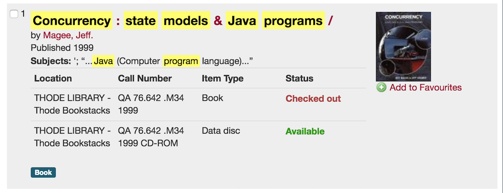
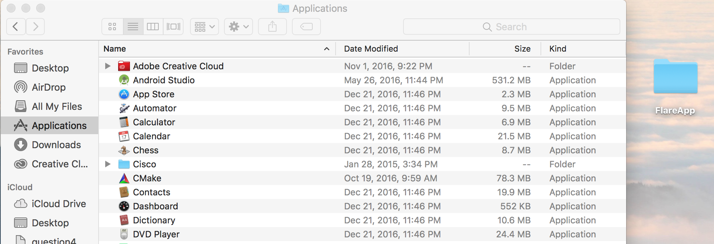
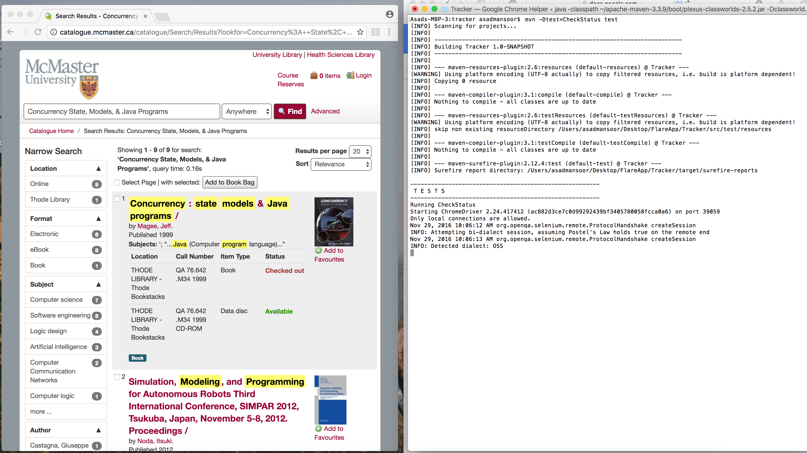
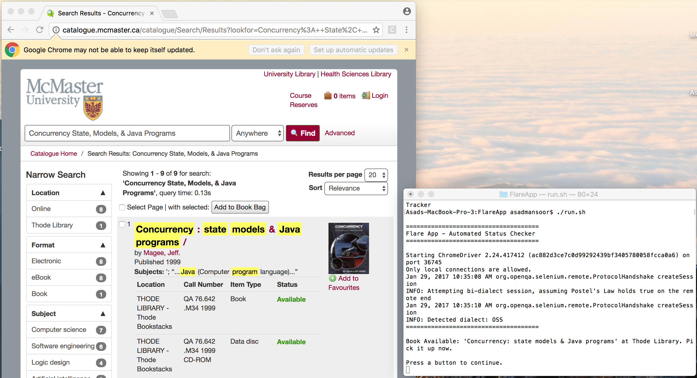

# Flare Application

Flare monitors the content of a specific element on a website and alerts the user if that content changes over a duration. This application is part of an experiment series developed by [Asad Mansoor](http://www.asadmansoor.com).

## Introduction

### Motivation

Textbooks are heavy and expensive, such that they can be replaced by online resources that are provided by the instructor or publisher of the textbook. Although these resources can be a good guide, but cannot be guaranteed to provide full insight as the textbook. So when exam season rolled in, I made the quick move and decided to check out a copy of the textbook from the campus library. However, the textbook would always be checked out and constantly checking would be a painful experience.

 

### Solution

The ideal solution is to outsource the process of checking whether the textbook is available or checked out as a background process and only alert the user when the textbook is available. Since the library catalogue is simply a web page, the use of Selenium WebDriver can be used to automate the process that I would do manually as an user.

### Reference

The following project is referenced in a blog post highlighting the motivation, requirements and design decisions in more detail. Please check out [Automated Status Checker: Experiment #1 - Web Automation](https://medium.com/@asadmansoor/automated-status-checker-111dd635b776#.ppyh708c9)

## Usage

### Prerequisites

* OS X 10.9 or above (Current development on macOS 10.12 Sierra)
* [Java](http://www.oracle.com/technetwork/java/javase/downloads/jdk8-downloads-2133151.html)
* [Maven](http://maven.apache.org/install.html)
* [Selenium Standalone Server](http://www.seleniumhq.org/download/)

Set Maven as an environment variable:

* Add path to .bash_profile. More information [here](http://stackoverflow.com/a/21326657)
* Verify by typing 'mvn -version' in Terminal

### Installation

Retrieve a copy of the project
```
Clone with SSH
git clone git@github.com:asadmansr/flare-application.git

Clone with HTTPS
git clone https://github.com/asadmansr/flare-application.git 
```

Move the project to the Applications folder

 


To *START* the test case:

* Navigate into the FlareApp and Run INSTALL.sh
  * This will schedule the run.sh to run multiple times a day (Apple may require your password)

To *STOP* the test case:
* Navigate into the FlareApp and Run UNINSTALL.sh

### Expected Behaviour

During the selected times, the run.sh will be executed and the following behaviour will be conduct in the background. Do not worry, this will not come in your way of using other applications.

 

### Expected Results

When the textbook is available, the following Terminal message will be prompted to alert the user. In addition, the web page will remain open for the user to verify that the book is available. If a fail was asserted, then the terminal and web page will close automatically.

 

